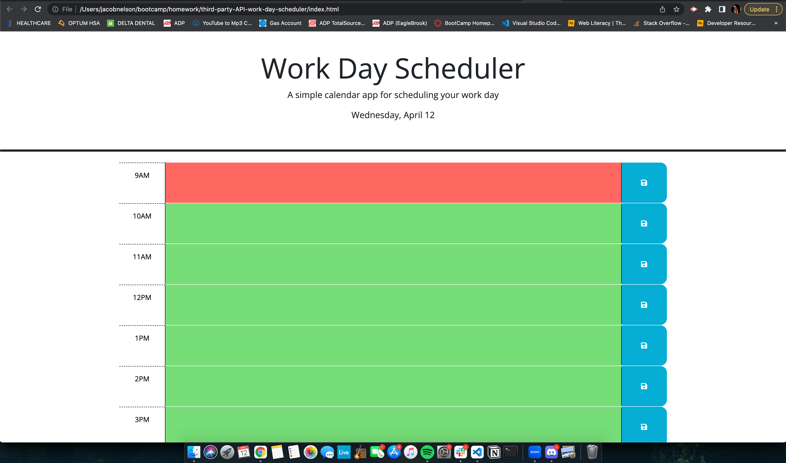

# Third-Party-API powered Workday Scheduler

* Our assignment for this unit was to power a work day schedule with jQuery and DayJS. We used local storage as well to save events on certain timeframes and make them persist on a page reload. DayJS was also used to dynamically change the color background of each hour row depending on whether the time was in the past, present, or future! 

## Links 

* [This is a link to the live site!](https://jacobdnelsonstone.github.io/third-party-API-work-day-scheduler/)
